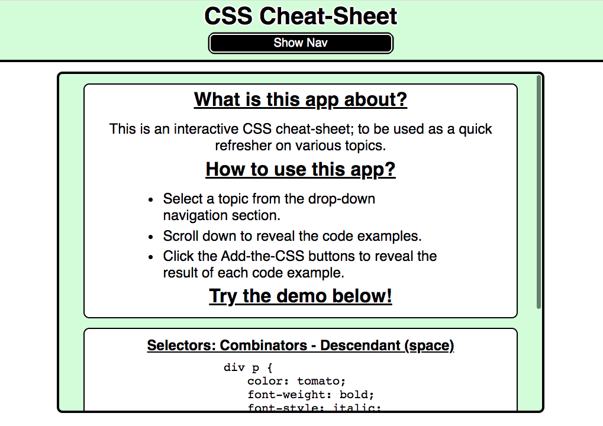
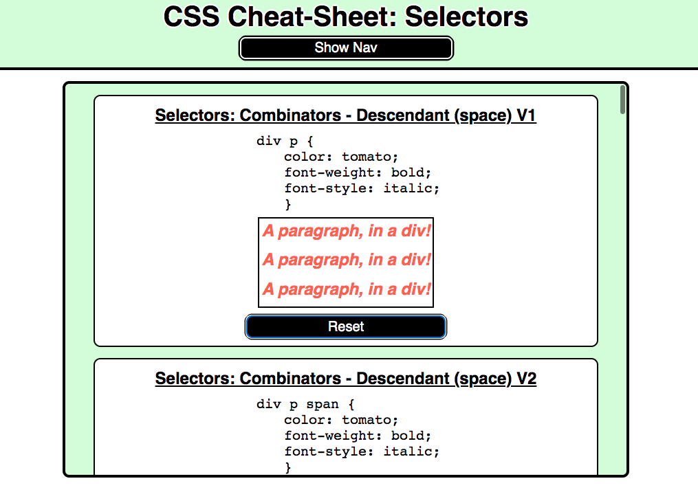
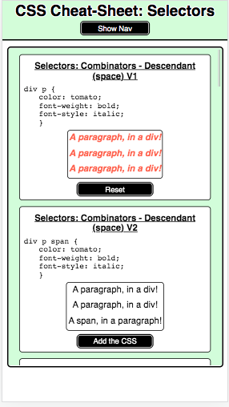

# CSS Interactive Cheat-Sheet

This is an interactive CSS cheat-sheet; to be used as a quick refresher.

## Features
* Code examples on multiple CSS topics.
* The option to click a button per code sample, revealing the resulting style updates.

---
## Built with:
* React.js
* CSS
---
## App Image: Starting Image.

---
## App Image: In-use Image.

---
## App Image: Responsive Example.

